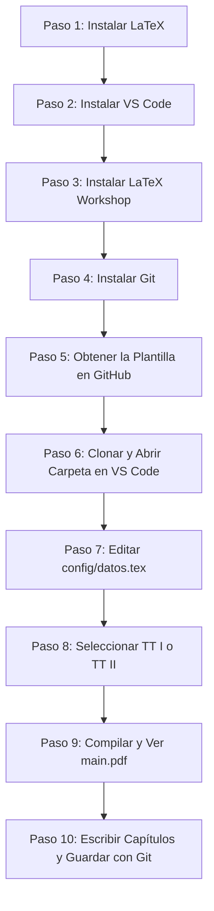

# Guía 00: Inicio Rápido para Principiantes

Esta guía está diseñada para estudiantes de Trabajo Terminal de la UPIIZ-IPN que **nunca antes han utilizado LaTeX, Git, GitHub o Visual Studio Code**. 

Sigue estos 10 pasos en orden para tener tu proyecto configurado y compilando en menos de 15 minutos.

---

## 🗺️ Mapa de Ruta en 10 Pasos



---

## Paso a Paso Detallado

### PASO 1: Instalar la Distribución LaTeX
LaTeX necesita un conjunto de programas (compilador, paquetes y tipografías).
- **En Windows:** Descarga e instala [MiKTeX](https://miktex.org/download) (selecciona la opción *"Install missing packages on-the-fly: Yes"*).
- **Comprobación:** Abre una terminal (PowerShell o CMD) y escribe:
  ```bash
  lualatex --version
  ```
  *(Si aparece la versión de LuaTeX / LuaHBTeX, tu instalación está lista).*
- 📖 *Guía detallada:* [01. Instalación de LaTeX](01-instalacion-latex.md)

---

### PASO 2: Instalar Visual Studio Code
VS Code es el editor de texto recomendado donde escribirás tu documento.
- Descarga e instala [Visual Studio Code para Windows](https://code.visualstudio.com/).
- Durante la instalación, marca la casilla **"Agregar la acción 'Abrir con Code' al menú contextual de Windows"**.
- 📖 *Guía detallada:* [02. Instalación de VS Code](02-instalacion-vscode.md)

---

### PASO 3: Instalar la Extensión LaTeX Workshop
Permite compilar LaTeX con un solo clic y ver el PDF en pantalla dividida dentro de VS Code.
1. Abre VS Code.
2. Presiona `Ctrl + Shift + X` para abrir el panel de Extensiones.
3. Busca **`LaTeX Workshop`** (desarrollada por James Yu) y haz clic en **Install**.
- 📖 *Guía detallada:* [03. Configuración de LaTeX Workshop](03-configuracion-latex-workshop.md)

---

### PASO 4: Instalar y Configurar Git
Git es la herramienta que guardará el historial de todas las versiones de tu reporte.
1. Descarga e instala [Git para Windows](https://git-scm.com/download/win).
2. Abre una terminal y configura tu nombre y correo institucional:
   ```bash
   git config --global user.name "Tu Nombre Completo"
   git config --global user.email "tu_correo@alumno.ipn.mx"
   ```
- 📖 *Guías detalladas:* [04. Instalación de Git](04-instalacion-git.md) y [05. Configuración de Git](05-configuracion-git.md)

---

### PASO 5: Crear tu Repositorio en GitHub a partir de la Plantilla
**NO descargues un ZIP ni trabajes directamente sobre el repositorio maestro del profesor.**
1. Inicia sesión en [GitHub](https://github.com/).
2. Entra al enlace oficial del repositorio de la plantilla.
3. Haz clic en el botón verde superior **`Use this template`** $\rightarrow$ **`Create a new repository`**.
4. Nombra tu repositorio como: `TT_Apellido1_Apellido2_TemaCorto` (ej. `TT_Robles_Hernandez_ControlMotor`).
5. Selecciona **Private** o **Public** según las indicaciones de tus asesores y haz clic en **Create repository**.
- 📖 *Guía detallada:* [07. Cómo Obtener la Plantilla](07-obtener-la-plantilla.md)

---

### PASO 6: Clonar y Abrir en VS Code
1. En tu nuevo repositorio de GitHub, copia la URL HTTPS (botón verde `<> Code`).
2. Abre una terminal en tu computadora en la carpeta donde guardas tus materias:
   ```bash
   git clone https://github.com/TU_USUARIO/TU_REPOSITORIO.git
   ```
3. Entra a la carpeta y ábrela en VS Code:
   ```bash
   code TU_REPOSITORIO
   ```

---

### PASO 7: Configurar tus Datos en `config/datos.tex`
1. En la barra lateral izquierda de VS Code, despliega la carpeta **`config`**.
2. Abre el archivo **`datos.tex`**.
3. Rellena los datos:
   - Título del proyecto.
   - Nombres y números de boleta de los integrantes.
   - Nombres de los asesores.
   - Nombres del sínodo/jurado.
   - Fecha y línea de trabajo.
- 📖 *Guía detallada:* [09. Configuración de Datos](09-configurar-datos-del-tt.md)

---

### PASO 8: Seleccionar Modalidad (TT I o TT II)
En las primeras líneas de `config/datos.tex`:
- Para **Trabajo Terminal I:**
  ```latex
  \TTItrue
  %\TTIfalse
  ```
- Para **Trabajo Terminal II / Reporte Final:**
  ```latex
  %\TTItrue
  \TTIfalse
  ```

---

### PASO 9: Realizar tu Primera Compilación
1. Abre el archivo **`main.tex`** en VS Code.
2. Presiona `Ctrl + Alt + B` (o haz clic en el ícono de la $\TeX$ en la barra lateral izquierda $\rightarrow$ *Build LaTeX project* $\rightarrow$ *Recipe: LuaLaTeX (latexmk)*).
3. Para ver el PDF al lado de tu código, presiona `Ctrl + Alt + V` (o haz clic en el ícono superior derecho de vista previa).
4. Verás tu portada oficial con tus nombres y tu documento formateado.
- 📖 *Guía detallada:* [16. Cómo Compilar](16-compilar.md)

---

### PASO 10: Escribir Capítulos y Guardar con Git
- Escribe cada sección en su archivo correspondiente dentro de `capitulos/` (ej. `01-introduccion.tex`, `02-justificacion.tex`).
- Cada vez que termines un bloque de trabajo, guarda tus avances en Git desde la terminal:
  ```bash
  git status
  git add .
  git commit -m "report: redacta marco teorico y agrega ecuaciones"
  git push
  ```
- 📖 *Guías detalladas:* [10. Escribir Capítulos](10-escribir-capitulos.md) y [18. Flujo Diario de Git](18-flujo-de-trabajo-git.md)

---

### ✅ ¿Todo funcionó correctamente?
¡Felicidades! Tu entorno de trabajo está listo. Consulta las guías específicas en `docs/` para aprender a insertar figuras, tablas, código o bibliografía.

### ❌ ¿Ocurrió algún error?
No te alarmes. Consulta la [Guía 22: Errores Comunes de LaTeX](22-errores-comunes-latex.md) o [Guía 24: Preguntas Frecuentes](24-preguntas-frecuentes.md).
