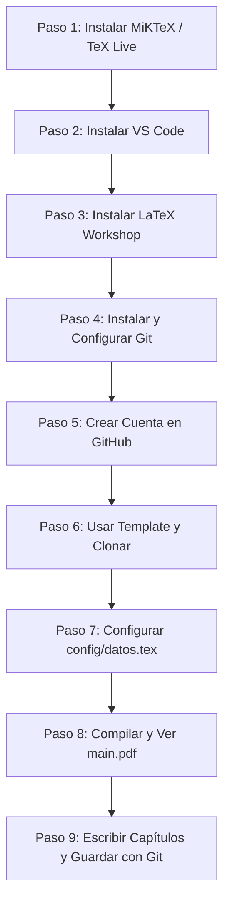

# Guía 00: Inicio Rápido desde Cero

Esta guía te llevará paso a paso para configurar tu computadora, descargar la plantilla institucional y compilar tu primer documento de **Trabajo Terminal** en menos de 15 minutos.

---

## 🧭 Resumen de Herramientas Necesarias

| Herramienta | Tipo | Función | Guía Detallada |
|---|---|---|---|
| **MiKTeX / TeX Live** | **Obligatorio** | Compilador LaTeX (**LuaLaTeX**) y utilitario `latexmk` | [Guía 01](01-instalacion-latex.md) |
| **Visual Studio Code** | **Obligatorio** | Editor de código recomendado | [Guía 02](02-instalacion-vscode.md) |
| **LaTeX Workshop** | **Obligatorio** | Extensión de VS Code para compilar con un clic | [Guía 03](03-configuracion-latex-workshop.md) |
| **Git y GitHub** | **Obligatorio** | Control de versiones y respaldo en la nube | [Guías 04–07](04-instalacion-git.md) |
| **Mendeley Reference Manager** | *Recomendado (Opcional)* | Gestor para recopilar citas y exportar BibTeX | [Guía 14a](14a-mendeley.md) |

---

## 🗺️ Mapa de Ruta del Proceso



---

## Paso a Paso Detallado

### PASO 1: Instalar la Distribución LaTeX
LaTeX necesita un conjunto de programas (compilador, paquetes y tipografías).
- **En Windows:** Descarga e instala [MiKTeX](https://miktex.org/download) (selecciona la opción *"Install missing packages on-the-fly: Yes"*).
- **Comprobación:** Abre una terminal (PowerShell o CMD) y escribe:
  ```bash
  lualatex --version
  ```
  *(Si aparece la versión de LuaTeX / LuaHBTeX, tu instalación está lista).*
- 📖 *Guía detallada:* [01. Instalación de LaTeX](01-instalacion-latex.md)

---

### PASO 2: Instalar Visual Studio Code
VS Code es el editor de texto recomendado donde escribirás tu documento.
- Descarga e instala [Visual Studio Code para Windows](https://code.visualstudio.com/).
- Durante la instalación, marca la casilla **"Agregar la acción 'Abrir con Code' al menú contextual de Windows"**.
- 📖 *Guía detallada:* [02. Instalación de VS Code](02-instalacion-vscode.md)

---

### PASO 3: Instalar la Extensión LaTeX Workshop
Permite compilar LaTeX con un solo clic y ver el PDF en pantalla dividida dentro de VS Code.
1. Abre VS Code.
2. Presiona `Ctrl + Shift + X` para abrir el panel de Extensiones.
3. Busca **`LaTeX Workshop`** (desarrollada por James Yu) y haz clic en **Install**.
- 📖 *Guía detallada:* [03. Configuración de LaTeX Workshop](03-configuracion-latex-workshop.md)

---

### PASO 4: Instalar y Configurar Git
Git es la herramienta que guardará el historial de todas las versiones de tu reporte.
1. Descarga e instala [Git para Windows](https://git-scm.com/download/win).
2. Abre una terminal y configura tu nombre y correo institucional:
   ```bash
   git config --global user.name "Mariana Robles Reynoso"
   git config --global user.email "mroblesr2020@alumno.ipn.mx"
   ```
- 📖 *Guías detalladas:* [04. Instalación de Git](04-instalacion-git.md) y [05. Configuración Inicial de Git](05-configuracion-git.md)

---

### PASO 5: Crear Cuenta en GitHub
GitHub es la plataforma en la nube donde alojarás el repositorio de tu Trabajo Terminal.
1. Regístrate gratis en [GitHub.com](https://github.com/).
- 📖 *Guía detallada:* [06. Cuenta y Uso de GitHub](06-github.md)

---

### PASO 6: Obtener la Plantilla y Clonar en tu Computadora
1. Entra al repositorio maestro institucional de la plantilla en GitHub.
2. Haz clic en el botón verde **`Use this template`** $\rightarrow$ **`Create a new repository`**.
3. Nombra tu repositorio (ejemplo: `TT-2026-Control-Vehiculo`).
4. Abre una terminal en tu computadora y clona tu nuevo repositorio:
   ```bash
   git clone https://github.com/TU_USUARIO/TU_REPOSITORIO.git
   ```
5. Abre la carpeta resultante con Visual Studio Code.
- 📖 *Guía detallada:* [07. Cómo Obtener la Plantilla](07-obtener-la-plantilla.md)

---

### PASO 7: Configurar Datos del Proyecto en `config/datos.tex`
Abre el archivo **`config/datos.tex`** y ajusta:
1. **Tipo de Documento:** `\TipoDocumento{PROTOCOLO}`, `\TipoDocumento{TTI}` o `\TipoDocumento{TTII}`.
2. **Línea de Trabajo:** `\LineaTrabajo{I}` a `\LineaTrabajo{VI}` conforme al Anexo 1.
3. **Título del proyecto** en español e inglés.
4. **Nombres y números de boleta** de los integrantes (1, 2 o 3 alumnos).
5. **Nombres de los asesores** y jurado evaluador.
- 📖 *Guía detallada:* [09. Configuración de Datos](09-configurar-datos-del-tt.md)

---

### PASO 8: Realizar tu Primera Compilación
1. Abre el archivo **`main.tex`** en VS Code.
2. Presiona `Ctrl + Alt + B` (o haz clic en el ícono de la $\TeX$ en la barra lateral izquierda $\rightarrow$ *Build LaTeX project* $\rightarrow$ *Recipe: LuaLaTeX (latexmk)*).
3. Para ver el PDF al lado de tu código, presiona `Ctrl + Alt + V` (o haz clic en el ícono superior derecho de vista previa).
4. Verás tu portada oficial con tus nombres y tu documento formateado.
- 📖 *Guía detallada:* [16. Cómo Compilar](16-compilar.md)

---

### PASO 9: Escribir Capítulos y Guardar con Git
- Escribe cada sección en su archivo correspondiente dentro de `capitulos/` (ej. `01-introduccion.tex`, `02-justificacion.tex`).
- Gestiona tu bibliografía con **Mendeley Reference Manager** ([Guía 14a](14a-mendeley.md)) o agregando entradas a `bibliografia/referencias.bib`.
- Cada vez que termines un bloque de trabajo, guarda tus avances en Git desde la terminal:
  ```bash
  git status
  git add .
  git commit -m "report: redacta marco teorico y agrega ecuaciones"
  git push
  ```
- 📖 *Guías detalladas:* [10. Escribir Capítulos](10-escribir-capitulos.md) y [18. Flujo Diario de Git](18-flujo-de-trabajo-git.md)

---

### ✅ ¿Todo funcionó correctamente?
¡Felicidades! Tu entorno de trabajo está listo. Consulta las guías específicas en `docs/` para aprender a insertar figuras, tablas, código o bibliografía.

### ❌ ¿Ocurrió algún error?
No te alarmes. Consulta la [Guía 22: Errores Comunes de LaTeX](22-errores-comunes-latex.md) o [Guía 24: Preguntas Frecuentes](24-preguntas-frecuentes.md).
