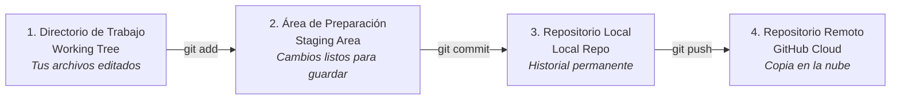

# Guía 17: Control de Versiones con Git

Esta guía explica los conceptos fundamentales de Git para que entiendas cómo guarda la historia de tu Trabajo Terminal y cómo te protege ante pérdidas de información.

---

## 1. Los Tres Estados de Git

En tu computadora, los archivos pasan por tres áreas antes de guardarse en el historial:

1. **Directorio de Trabajo (Working Tree):** Son los archivos `.tex`, `.bib` e imágenes que estás editando en este momento en VS Code.
2. **Área de Preparación (Staging Area):** Es la lista de cambios específicos que le dices a Git: *"estos son los archivos que formarán parte del próximo guardado"*. Se agregan con `git add`.
3. **Repositorio Local (Commit):** Es una fotografía instantánea (*snapshot*) de tu proyecto con una descripción de lo realizado. Se guarda con `git commit`.
4. **Repositorio Remoto (GitHub):** Es la copia en los servidores de GitHub que permite compartir avances con tu equipo y asesores. Se actualiza con `git push`.

---

## 2. ¿Qué es un Commit?

Un **commit** es un punto de guardado en la línea de tiempo de tu proyecto. Cada commit tiene:
- Un identificador único (ej. `a1b2c3d`).
- El nombre y correo del autor.
- La fecha y hora exacta.
- Un mensaje descriptivo de los cambios realizados.

---

## 3. Adiós a las Copias Múltiples de Archivos

Gracias a Git, **NUNCA debes duplicar archivos manualmente**:
- ❌ `Capitulo1_modificado_Mariana.tex`
- ❌ `Capitulo1_revisado_asesor.tex`
- ❌ `Capitulo1_version_final_buena.tex`

Tu proyecto siempre tendrá un único `01-introduccion.tex`. Git se encarga de guardar todas las versiones históricas que ha tenido ese archivo desde el primer día.

---

## 4. Próximo Paso

Continúa con la [Guía 18: Flujo de Trabajo Diario con Git](18-flujo-de-trabajo-git.md).
