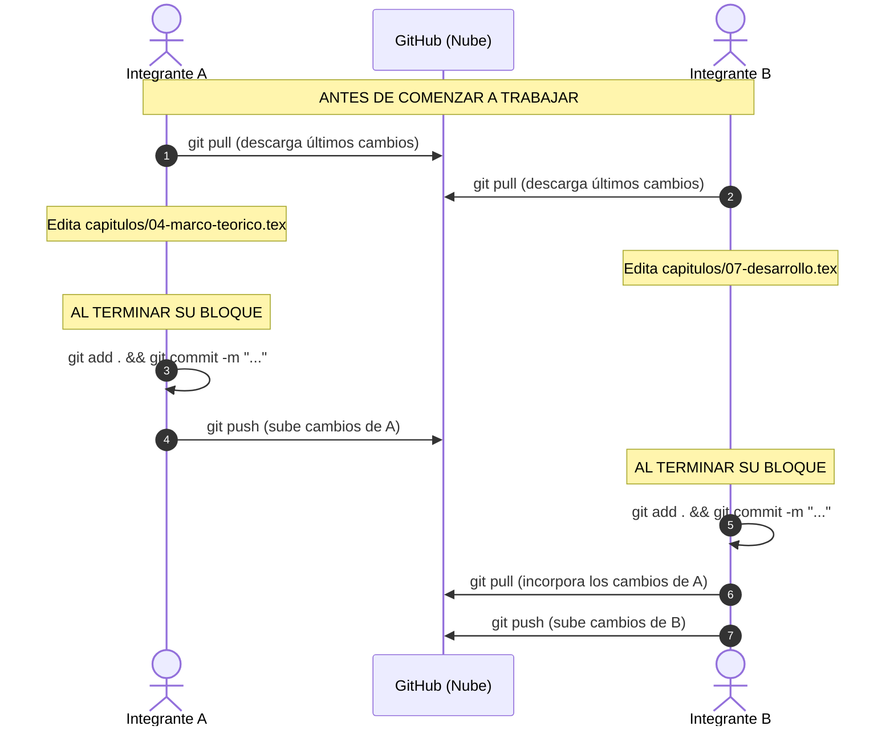

# Guía 19: Trabajo en Equipo para 2 o 3 Integrantes

Esta guía establece el protocolo de colaboración para trabajar simultáneamente en equipo sin sobrescribir el trabajo de tus compañeros.

---

## 1. El Protocolo de Oro del Trabajo en Equipo



---

## 2. Regla Fundamental: SIEMPRE hacer `git pull` antes de empezar

Antes de abrir VS Code y ponerte a escribir:

```bash
git pull
```

Este comando descarga en tu computadora todas las modificaciones que hayan subido tus compañeros desde GitHub. Si no haces `git pull`, estarás trabajando sobre una versión desactualizada.

---

## 3. La Ventaja de la Estructura Modular de la Plantilla

La plantilla divide el documento en archivos independientes dentro de `capitulos/`:
- Mientras un integrante redacta el `04-marco-teorico.tex`, otro puede estar trabajando en `07-desarrollo.tex` y otro en `bibliografia/referencias.bib`.
- **Como los cambios ocurren en archivos distintos, Git los fusiona automáticamente al 100% sin generar ningún conflicto.**

---

## 4. Uso de Ramas Simples para Avances Grandes

Si vas a realizar un cambio grande y no quieres interferir con la compilación de tus compañeros mientras terminas:

1. **Crea y cámbiate a una rama nueva:**
   ```bash
   git switch -c diseno-mecanico
   ```
2. Trabaja, compila y haz commits en tu rama:
   ```bash
   git add .
   git commit -m "report: completa calculos de esfuerzos"
   ```
3. Cuando tu sección esté lista y compile sin errores, regresa a `main` e integra tus cambios:
   ```bash
   git switch main
   git pull
   git merge diseno-mecanico
   git push
   ```
4. Elimina la rama temporal:
   ```bash
   git branch -d diseno-mecanico
   ```

---

## 5. Próximo Paso

Continúa con la [Guía 20: Cómo Resolver Conflictos en Git](20-resolver-conflictos.md).
