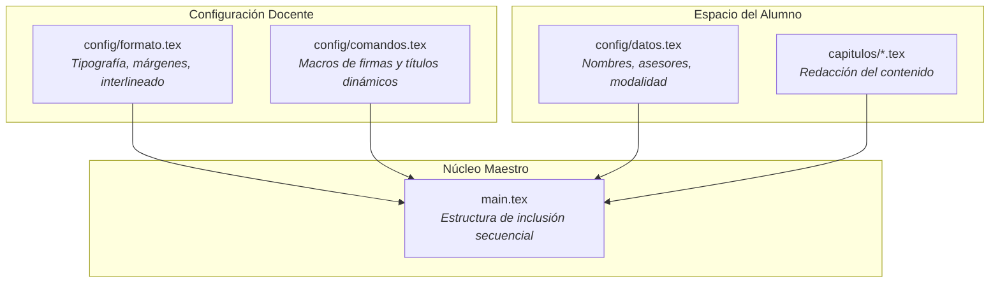

# Guía Docente: Mantenimiento y Gobernanza de la Plantilla

Esta guía está dirigida a los profesores titulares, presidentes de academia y administradores del repositorio maestro de la **Plantilla Institucional de Trabajo Terminal**.

---

## 1. Principios de Arquitectura y Separación de Responsabilidades

La plantilla fue diseñada como un proyecto de software mantenible a largo plazo, siguiendo tres principios clave:

- **Separación estricta entre formato y contenido:** Si la academia modifica los márgenes o el interlineado en el futuro, solo debe editarse `config/formato.tex`. Los alumnos no necesitan reescribir sus capítulos.
- **Cero dependencias externas:** La plantilla no depende de scripts en Python ni de ejecutables propietarios; funciona con macros puras de LaTeX y `latexmk`.

---

## 2. Batería de Pruebas Obligatoria para Nuevas Versiones

Antes de aprobar cambios o publicar una nueva versión, el docente debe verificar que la plantilla compile en los siguientes 6 escenarios base:

1. **Escenario A (TT I - Individual):** `\TTItrue`, 1 alumno, 1 asesor.
2. **Escenario B (TT I - Equipo):** `\TTItrue`, 3 alumnos, 3 asesores.
3. **Escenario C (TT II - Individual):** `\TTIfalse`, 1 alumno, 2 asesores.
4. **Escenario D (TT II - Equipo):** `\TTIfalse`, 2 alumnos, 2 asesores.
5. **Escenario E (Título largo):** Título de más de 3 líneas para verificar que no se desborde la portada.
6. **Escenario F (Bibliografía completa):** Ejecución de `bibtex` y resolución limpia de citas IEEE.

---

## 3. Monitoreo de Integración Continua (CI)

El archivo `.github/workflows/latex.yml` compila automáticamente el documento en cada *Push* y *Pull Request* hacia la rama `main` en los servidores de GitHub Actions. Si un cambio rompe la compilación, GitHub mostrará una cruz roja `❌` alertando al profesor antes de fusionar el código.
