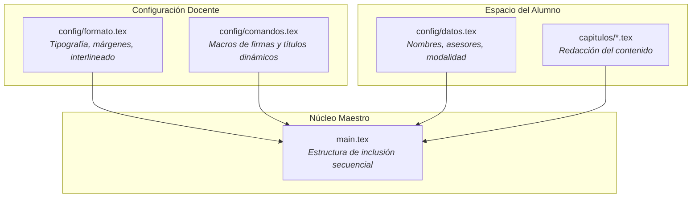

# Guía Docente: Mantenimiento y Gobernanza de la Plantilla

Esta guía está dirigida a los profesores titulares, presidentes de academia y administradores del repositorio maestro de la **Plantilla Institucional de Trabajo Terminal**.

---

## 1. Principios de Arquitectura y Separación de Responsabilidades

La plantilla fue diseñada como un proyecto de software mantenible a largo plazo, siguiendo tres principios clave:

- **Separación estricta entre formato y contenido:** Si la academia modifica los márgenes o el interlineado en el futuro, solo debe editarse `config/formato.tex`. Los alumnos no necesitan reescribir sus capítulos.
- **Cero dependencias externas:** La plantilla no depende de scripts en Python ni de ejecutables propietarios; funciona con macros puras de LaTeX y `latexmk`.

---

## 2. Batería de Pruebas Obligatoria para Nuevas Versiones

Antes de aprobar cambios o publicar una nueva versión, el docente debe verificar que la plantilla compile en los siguientes 6 escenarios base:

1. **Escenario A (TT I - Individual):** `\TTItrue`, 1 alumno, 1 asesor.
2. **Escenario B (TT I - Equipo):** `\TTItrue`, 3 alumnos, 3 asesores.
3. **Escenario C (TT II - Individual):** `\TTIfalse`, 1 alumno, 2 asesores.
4. **Escenario D (TT II - Equipo):** `\TTIfalse`, 2 alumnos, 2 asesores.
5. **Escenario E (Título largo):** Título de más de 3 líneas para verificar que no se desborde la portada.
6. **Escenario F (Bibliografía completa):** Ejecución de `bibtex` y resolución limpia de citas IEEE.

---

## 3. Monitoreo de Integración Continua (CI)

El archivo `.github/workflows/latex.yml` compila automáticamente el documento en cada *Push* y *Pull Request* hacia la rama `main` en los servidores de GitHub Actions. Si un cambio rompe la compilación, GitHub mostrará una cruz roja `❌` alertando al profesor antes de fusionar el código.

---

## 4. Autores y Mantenedores de la Plantilla

La plantilla fue diseñada y desarrollada por profesores de la academia de Ingeniería Mecatrónica de la Unidad Profesional Interdisciplinaria de Ingeniería Campus Zacatecas (UPIIZ-IPN):

- **M. en C. Rafael Reveles Martínez** ([ORCID: 0000-0001-6075-1242](https://orcid.org/0000-0001-6075-1242))
- **M. en C. Flabio Darío Mirelez Delgado** ([ORCID: 0000-0003-3547-9739](https://orcid.org/0000-0003-3547-9739))
- **M. en C. Umanel Azazael Hernández González** ([ORCID: 0000-0002-4109-1776](https://orcid.org/0000-0002-4109-1776))

Las futuras modificaciones a la estructura o requisitos normativos deben coordinarse mediante:
- **Ramas y Pull Requests** en GitHub con revisión de pares.
- **Registro detallado en `CHANGELOG.md`** siguiendo Versionado Semántico (SemVer).
- **Ejecución del suite de pruebas** en `tests/`.

---

## 5. Protección del Repositorio Maestro

Para evitar alteraciones accidentales a la plantilla institucional:
- **No agregar alumnos como colaboradores:** Los estudiantes no requieren permisos de escritura en el repositorio maestro; únicamente deben usar el botón **`Use this template`** para crear su propia copia independiente.
- **Configuración como Template Repository:** Permite que cualquier alumno clone la estructura base sin vincular su historial de desarrollo con el repositorio maestro.
- **Protección de la rama `main`:** Mantener activadas las reglas de protección contra *Force Push* (`git push --force`) y eliminación accidental de rama.
- **Recepción de mejoras:** Si algún profesor o estudiante propone una mejora al formato general, esta debe recibirse exclusivamente mediante **Pull Requests** hacia la rama `main`.
- **Revisión periódica de permisos:** Verificar regularmente en *Settings $\rightarrow$ Collaborators* que únicamente los profesores mantenedores tengan privilegios de administración.
